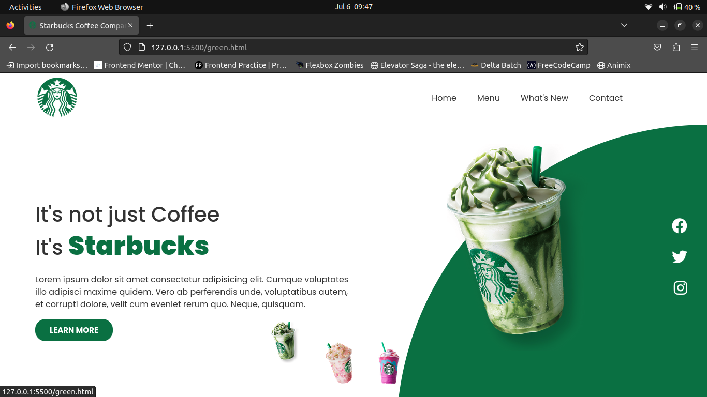
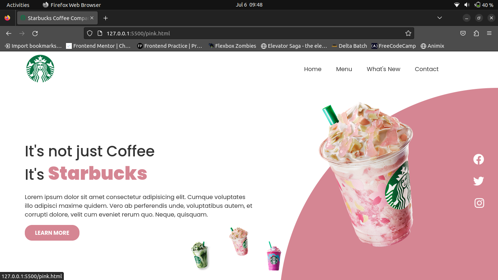
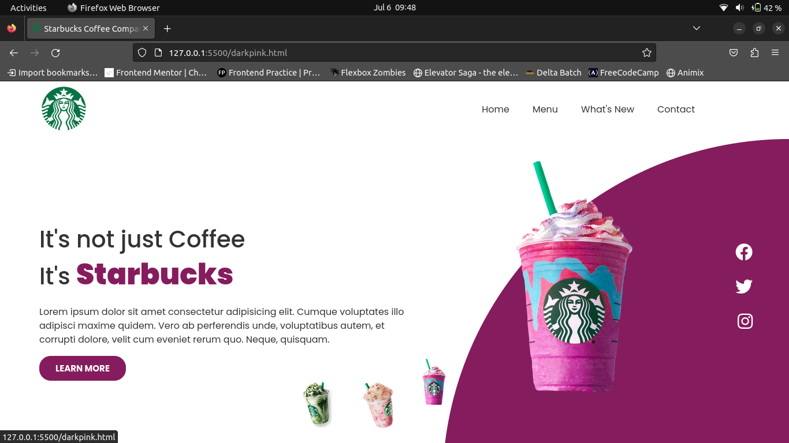

# Starbucks-Frontend-Project

This project is a landing page design for Starbucks that I created to practice the skills I have learned in HTML5 and CSS3 and to apply them in building a functional webpage.

Screenshots:-

<h2>Build With:</h2>
<ul>
  <li>HTML5</li>
  <li>CSS3</li>
</ul>
<h2>Made by</h2>
<a href="https://github.com/S11UB11AYAN">Shubhayan Bagchi</a>

<ul>
  <li><a href="https://www.linkedin.com/in/shubhayan-bagchi-b83522275/">LinkedIN</a></li>
</ul>
